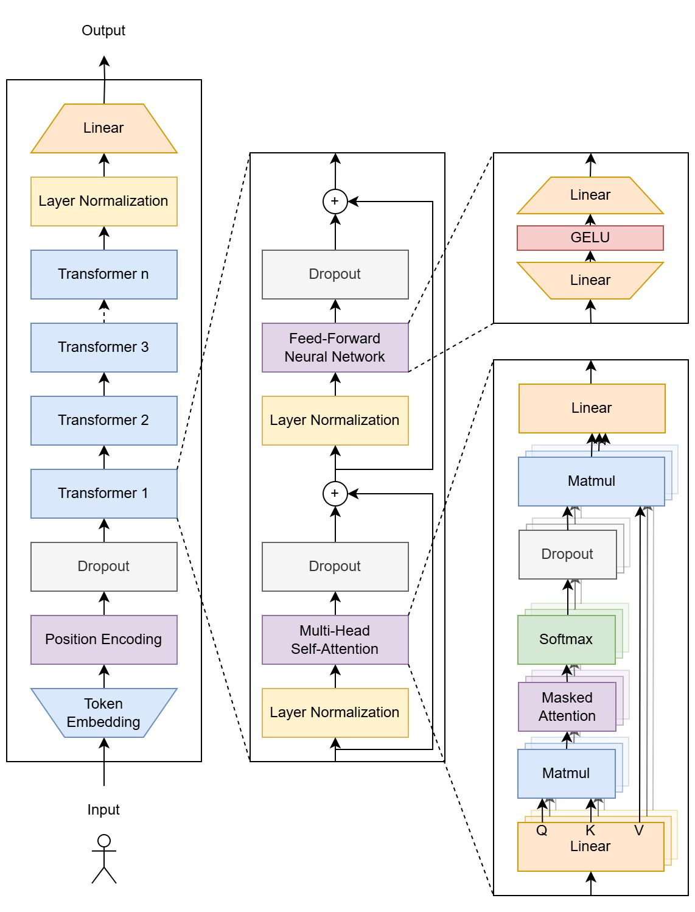

# TinyLM

Small language model written in Python from scratch, based on the GPT-2 architecture.

```
python main.py --help
usage: main.py [-h] (-i | -t) [-c | -g] [-m MODEL] [-d DATASET] [-o OUTPUT] [-p PROMPT]

options:
  -h, --help            show this help message and exit
  -i, --inference       Select inference mode
  -t, --training        Select training mode
  -c, --cpu             Set training to use CPU only
  -g, --gpu             Set training to use GPU via CUDA
  -m, --model MODEL     Path to the model (works both in inference and training mode)
  -d, --dataset DATASET Path to the text file (works only in training mode)
  -o, --output OUTPUT   Path to the output model (works in training mode only)
  -p, --prompt PROMPT   Prompt for inference mode
```

## Dependencies
 - [PyTorch](https://github.com/pytorch/pytorch) - machine learning (preferably CUDA version)
 - [NumPy](https://github.com/numpy/numpy) - matrices, complex math operations
 - [bidict](https://github.com/jab/bidict) - bidirectional map for token dictionary

## Project Structure

 - [main.py](./src/main.py) - entry point, parses CLI parameters, initializes inference and training
 - [dataset.py](./src/dataset.py) - loads text file and processes it into a list of tokens usable for the training
 - [tokens.py](./src/tokens.py) - manages the token dictionary, contains methods for encoding and decoding tokens
 - [model.py](./src/model.py) - implementation of GPT-2 architecture and model persistence
 - [training.py](./src/training.py) - provides training loop for the model

# Model Architecture



## Input

Before the model starts processing any data, the text sequence has to be converted into a form that can be understood by the neural network. Some of the more popular tokenization methods include:
 - character-level tokens - every character represents a separate token, simple and can deal with unknown words, but takes longer to train; used by TinyLM
 - word-level tokens - every word represents a separate token
 - [Byte-Pair Encoding](https://en.wikipedia.org/wiki/Byte-pair_encoding) - every word is split into smaller substrings, depending on how frequently they occur in the dataset; used by GPT-2

For example, prompt `Cat` can be split into tokens `C`, `a`, `t`, and then converted into their corresponding numbers: `[ 12, 6, 7 ]`.

## Token Embedding

Each token has its own unique vector of numbers (called embeddings) stored in a lookup table, learned during the training process. In the case of TinyLM, it's usually between 128 and 256 values, although it greatly varies depending on available hardware.

For tokens `[ 12, 6, 7 ]` from the previous layer, the result of embedding (in the form of a matrix) can look like this:

```
[ 0.15, 0.76, 0.43, 0.58 ]
[ 0.32, 0.21, 0.44, 0.52 ]
[ 0.26, 0.74, 0.25, 0.53 ]
```

## Position Encoding

The model can operate on multiple tokens at once, but they alone don't have information about position within the sentence (row order in the matrix does not provide this in usable form). To prevent confusion between `cat eats food` and `food eats cat`, each possible location within the context has its own unique vector of numbers, added to the embeddings.

```
[ 0.15, 0.76, 0.43, 0.58 ]   [0.1, 0.2, 0.1, 0.2]   [ 0.25, 0.96, 0.53, 0.78 ]
[ 0.32, 0.21, 0.44, 0.52 ] + [0.2, 0.1, 0.2, 0.1] = [ 0.52, 0.31, 0.64, 0.62 ]
[ 0.26, 0.74, 0.25, 0.53 ]   [0.1, 0.1, 0.1, 0.1]   [ 0.36, 0.84, 0.35, 0.63 ]
```

## Transformer

Transformer architecture has been described for the first time in 2017 in the famous paper "[Attention Is All You Need](https://arxiv.org/pdf/1706.03762)", and since then has become a core building block for every language model, responsible for processing relationship between tokens and enhancing their embeddings with more context. There are usually multiple transformers per model, connected sequentially; for a small model, between 3 and 6 is a good range. Each of them contains two main components: multi-head self-attention and a feed-forward neural network.

The architecture of the transformer allows for processing all tokens at once, which is a major advantage compared to recurrent neural networks and greatly benefits inference and training time.

### Multi-Head Self-Attention

The self-attention algorithm enhances token embeddings by contextualizing them within sentences. Each token is projected into three separate matrices:
 - Query - represents token's relationship with other ones in the sentence
 - Key - represents token features
 - Value - represents token value

In the next step, Query and Key matrices are compared (by multiplying), scaled by the square root of the embedding size, processed by the softmax function; the resulting weights (in the form of a matrix representing how token `i` is relevant to token `j`) are then used to obtain the values.

<p align="center">
  
  </br>
  <em>Self-attention formula</em>
</p>

Another important element of a transformer is causal masking, which ensures that a particular token can see attention weights only from previous tokens in the sentence. This improves training, as they can't "cheat" by looking into the future.

To improve the recognition of various grammatical and punctuation features, embeddings are split into heads, each one performing its own self-attention calculation. The results are then concatenated and passed through an additional linear layer to unify the results again.

### Feed-Forward Neural Network

The result from the previous block is processed in a two-layer feed-forward neural network, with GELU as the activation function. It enhances the model's capability to process more complex structures, using embeddings enhanced by attention context.

<p align="center">
  
  </br>
  <em>GELU activation function</em>
</p>

## Output

The output of the last transformer is projected by a linear layer into logits - raw, unnormalized values associated with each token. Applying the softmax function turns them into probabilities, which is the final result of the model that tells what the most likely next token is based on the provided input.

# Training

The training loop is based on AdamW optimizer, a highly effective algorithm combining the advantages of Momentum and RMSprop techniques. In addition, a special learning rate scheduler is used to halve it every time it detects a plateau in average loss, so the model weights can be fine-tuned.

To calculate how well the model predicts the next tokens during training, a cross-entropy loss mechanism is used:
 - the more confident it is when predicting a correct token, the lower the loss
 - the more confident it is when predicting a wrong token, the higher the loss

# Examples

The test was conducted by choosing "Lalka" written by Bolesław Prus as the dataset for training. The goal was to imitate the writing style, although without maintaining any reasonable coherence, as the model is too small (2 million parameters, as shown below) to really understand the language, especially for a complex one like Polish.

The inference example shows that the model, in most cases, is able to construct valid words and can follow grammatical and punctuation rules for a short time. Writing style resembles the one from the book, although despite considerable context length (512 characters), it has a lot of trouble with generating consistent sentences.

## Training

```
2026-05-02 12:01:45 INFO    | ========== TRAINING MODE ==========
2026-05-02 12:01:45 INFO    | Dataset: ./datasets/lalka.txt
2026-05-02 12:01:45 INFO    | Output: ./models/lalka_v1.model
2026-05-02 12:01:45 INFO    | Device: cuda
2026-05-02 12:01:45 INFO    | ===================================
2026-05-02 12:01:45 INFO    | Loading dataset...
2026-05-02 12:01:45 INFO    | Done, loaded 1611471 bytes (1.54 MB)
2026-05-02 12:01:45 INFO    | Dataset:
2026-05-02 12:01:45 INFO    | - vocabulary size: 103
2026-05-02 12:01:45 INFO    | - chunks: 12585
2026-05-02 12:01:45 INFO    | - chunk size: 512
2026-05-02 12:01:46 INFO    | Model:
2026-05-02 12:01:46 INFO    | - parameters: 1915392
2026-05-02 12:01:46 INFO    | - embedding size: 192
2026-05-02 12:01:46 INFO    | - context size: 512
2026-05-02 12:01:46 INFO    | - transformers: 4
2026-05-02 12:01:46 INFO    | - heads count: 4
2026-05-02 12:01:46 INFO    | - ff network size: 768
2026-05-02 12:01:46 INFO    | - dropout rate: 0.1
2026-05-02 12:01:49 INFO    | Trainer:
2026-05-02 12:01:49 INFO    | - max epoch: 10000
2026-05-02 12:01:49 INFO    | - batch size: 32
2026-05-02 12:01:49 INFO    | - learning rate: 0.001
2026-05-02 12:01:49 INFO    | - beta1: 0.9
2026-05-02 12:01:49 INFO    | - beta2: 0.95
2026-05-02 12:01:49 INFO    | - weight decay: 0.01
2026-05-02 12:01:49 INFO    | Switching to training loop
2026-05-02 12:02:34 INFO    | Epoch 1 done in 45.38 seconds, learning rate: 0.001, average loss: 2.5609
2026-05-02 12:03:19 INFO    | Epoch 2 done in 44.86 seconds, learning rate: 0.001, average loss: 2.3275
2026-05-02 12:04:04 INFO    | Epoch 3 done in 44.84 seconds, learning rate: 0.001, average loss: 2.0593
2026-05-02 12:04:49 INFO    | Epoch 4 done in 44.83 seconds, learning rate: 0.001, average loss: 1.8865
2026-05-02 12:05:33 INFO    | Epoch 5 done in 44.83 seconds, learning rate: 0.001, average loss: 1.7740
2026-05-02 12:06:18 INFO    | Epoch 6 done in 44.89 seconds, learning rate: 0.001, average loss: 1.6969
2026-05-02 12:07:03 INFO    | Epoch 7 done in 44.85 seconds, learning rate: 0.001, average loss: 1.6382
2026-05-02 12:07:48 INFO    | Epoch 8 done in 44.79 seconds, learning rate: 0.001, average loss: 1.5904
```

## Inference

```
2026-05-03 11:05:07 INFO    | ========== INFERENCE MODE ==========
2026-05-03 11:05:07 INFO    | Model: .././models/lalka_v1.model
2026-05-03 11:05:07 INFO    | Prompt: Wiem ja, dlaczego tak szeroko rozpisałem się o sprawie pani Stawskiej. Oto dlaczego…
2026-05-03 11:05:07 INFO    | Device: cuda
2026-05-03 11:05:07 INFO    | ====================================
2026-05-03 11:05:07 INFO    | Loading model...
2026-05-03 11:05:07 INFO    | Model:
2026-05-03 11:05:07 INFO    | - parameters: 1915392
2026-05-03 11:05:07 INFO    | - embedding size: 192
2026-05-03 11:05:07 INFO    | - context size: 512
2026-05-03 11:05:07 INFO    | - transformers count: 4
2026-05-03 11:05:07 INFO    | - ff network size: 768
2026-05-03 11:05:07 INFO    | Output:
-------------------------------------
Wiem ja, dlaczego tak szeroko rozpisałem się o sprawie pani Stawskiej. Oto dlaczego…
Powóz spojrzała na mnie.
— Wybornie wolny panie — rzekła pani Wąsowska.
Gdy wyszła nagle w ręku, zapytała: „Co on ma pan tak? Nie ma szkło?…” — pomyślała.
Ale po chwili Wokulski przyszedł do nich, powinien być przedmiot po kilku dni nie mogłem zdobyć się o przedpokoju. W tej chwili powoli, żeby nie wszystko zdrowie przez całą straszność przeczucia… To już pojutrze okrytych… Po podłym pożegnaniu dawniej zaczął się wychodzić do nas przeszły.
Spojrzał na bruk po kilka dniach i po chwili wysunął się na stronę ruiny: czy tyle znajdzie się w piwnicach i bogatych stron. Na próżno wszedł do procesu, zaczęliśmy również spojrzeć, podobno do sklepu dodał, że jest to wyrobem podobnym do takiej porze wypatrawszy się nie mówiąc: jakie on wypije i miłości, wielbicieli się we wrześniości, które powtórzyły.
„Dziękuję ci, panie Wokulski? — pomyślał Wokulski. — On zawsze musiał też, a ponieważ znowu zapomniał sobie, że nie ma jednego nieszczęścia, kiedy ma się za mną podejrzaną… Zaraz pójdę o trzydzieści tysięcy rubli, kariery… Nic… przecie nie pozwoli pani…” Ależ na to, co się to nie widziało w niej wyraziste sposoby. Nie pomyślał tej samej kamienicy, choćby znał, że nie poważyła mu się z nimi widząc, że panna Izabela, przypatrywała mu się ze zmieszaną pracą, a pani Meliton odpisała mu się z nią i z panią Stawską.
— Czy to znaczy?… — spytała pani Wąsowska.
— Tak, to jest to wszystko na tym procesie, ażebym napisał…
— Cóż to za rok?
— Nu, to jest w pokoju.
— Jest to właśnie za młodości… Ale tak…
— Mamo, panie, na to, co się to mówiła z marszałka, panie Mraczewski…
— Jedno! — wołała panna Izabela. — Chyba zrobiła nawet podobna.
— Powiedz pan — odezwał się Stach — jestem ojciec tym wynudzonym.
Pani Stawska wzruszyła ramionami, który mieli przeciw nowej pośrednictwie…
Patrzył na nią w niego na nią z duży wziął się do pomyślnego, przeczytała go po swym sługiem.
```